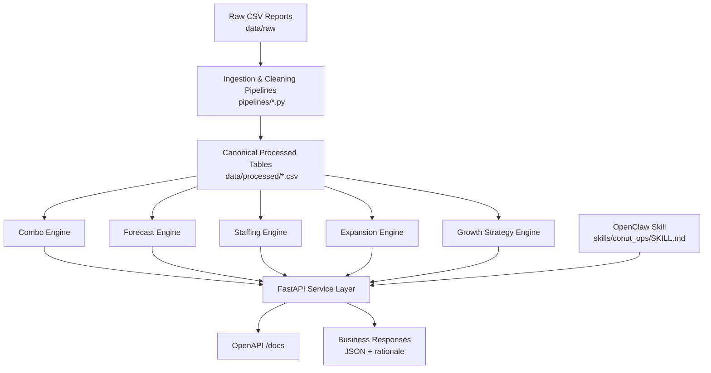
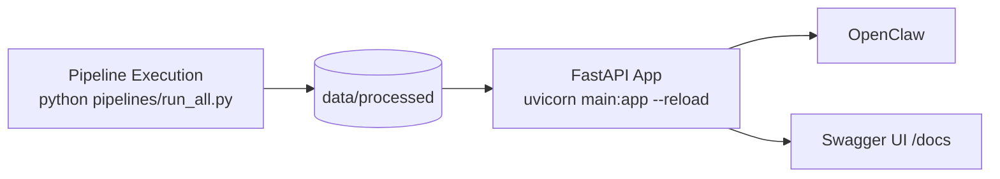

# Architecture Blueprint

## 1) Objective Coverage

This architecture is designed to satisfy all hackathon objectives:
1. Combo Optimization
2. Demand Forecasting by Branch
3. Expansion Feasibility
4. Shift Staffing Estimation
5. Coffee & Milkshake Growth Strategy
6. OpenClaw Integration

## 2) System Architecture (Logical)

## 3) Layer Responsibilities

### Data Layer
- Parse report-style CSV exports with repeated headers/page markers.
- Normalize branch names and datatypes.
- Remove duplicates, subtotal/total noise, and malformed lines.
- Persist canonical tables in `data/processed/`.

### Analytics Layer
- **Combo**: support, confidence, lift using basket lines.
- **Forecast**: weighted moving average + trend baseline per branch.
- **Staffing**: branch+shift staffing baseline with demand adjustment.
- **Expansion**: weighted scorecard and branch archetype replication.
- **Growth**: beverage penetration + branch-level opportunity ranking.

### Service Layer
- FastAPI endpoints exposing inference functions.
- Request validation via Pydantic schemas.
- Standardized response contracts with confidence/assumptions.

### Agent Layer (OpenClaw)
- Map operational prompts to endpoint calls.
- Return recommendations with traceable evidence from processed tables.

## 4) Canonical Processed Data Contracts

Expected outputs in `data/processed/`:

- `branch_monthly_sales.csv`
  - `branch`, `month`, `sales_value`, `orders`, `customers`
- `category_channel_sales.csv`
  - `branch`, `period`, `channel`, `category`, `sales_value`
- `item_sales.csv`
  - `branch`, `period`, `item`, `category`, `qty`, `sales_value`
- `customer_orders.csv`
  - `customer_id`, `branch`, `first_order`, `last_order`, `order_count`, `total_value`
- `basket_lines.csv`
  - `order_id`, `branch`, `timestamp`, `item`, `category`, `qty`, `line_value`
- `attendance.csv`
  - `employee_id`, `branch`, `date`, `shift`, `in_time`, `out_time`, `hours_worked`
- `menu_channel_summary.csv`
  - `branch`, `period`, `menu`, `channel`, `sales_value`, `avg_ticket`
- `branch_kpis.csv`
  - `branch`, `demand_index`, `trend_label`, `beverage_share`, `repeat_signal`, `expansion_score`

## 5) API Contract (Target)

- `GET /health`
- `POST /combo`
- `POST /forecast`
- `POST /staffing`
- `POST /expansion`
- `POST /growth-strategy`
- `GET /summary` (optional)

### Response Design Principle
Each endpoint returns:
- result values,
- short explanation,
- assumptions/limitations,
- confidence indicator.

## 6) Runtime Architecture (Local)

## 7) Deployment Reference (Hackathon)

- **Mode**: local-first, reproducible execution.
- **Compute**: single Python runtime.
- **Storage**: file-based CSV datasets.
- **Interface**: FastAPI + OpenClaw skill.
- **Evidence**: API responses + OpenClaw screenshots/video.

## 8) Non-Functional Requirements

- Reproducibility with pinned dependencies.
- Deterministic pipeline outputs.
- Explainable methods over black-box complexity.
- Defensive cleaning against malformed report exports.

## 9) Risks & Controls

- **Messy report CSVs** → strict row filters + schema checks.
- **Short forecast horizon** → lightweight models + confidence notes.
- **Sparse geospatial data** → expansion profile recommendation instead of exact geo targeting.
- **Scaled numeric values** → ratio and trend-based interpretation.
