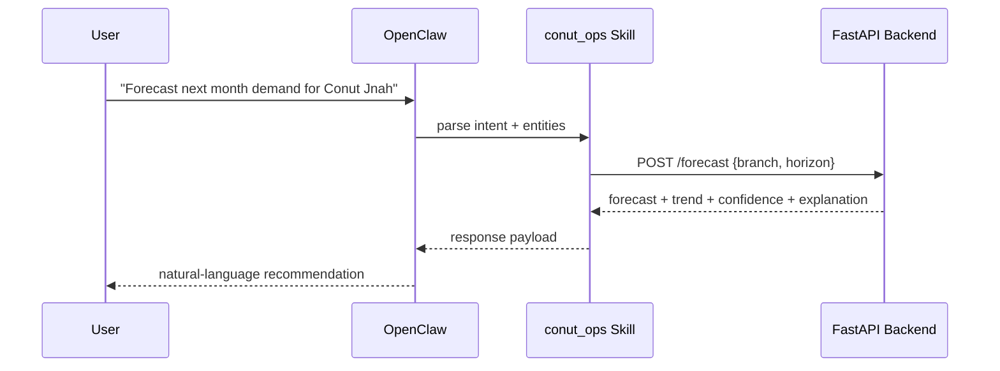

# OpenClaw Integration Contract

## Purpose

Enable OpenClaw to call the Chief of Operations backend for operational Q&A and recommendations.

## Integration Pattern

OpenClaw Skill (`skills/conut_ops/SKILL.md`) routes prompt intents to FastAPI endpoints.



## Endpoint Mapping

- Intent: combo recommendation → `POST /combo`
- Intent: branch demand prediction → `POST /forecast`
- Intent: staffing recommendation → `POST /staffing`
- Intent: expansion check → `POST /expansion`
- Intent: beverage growth plan → `POST /growth-strategy`
- Intent: system status → `GET /health`

## Minimal Request/Response Shape

### `POST /forecast`
Request:
```json
{
  "branch": "Conut Jnah",
  "horizon_months": 1
}
```

Response:
```json
{
  "branch": "Conut Jnah",
  "forecast_index": 1.08,
  "trend": "growing",
  "confidence": "medium",
  "explanation": "Positive short-term trend and stable order flow.",
  "assumptions": ["Scaled values interpreted relatively"]
}
```

### `POST /combo`
Request:
```json
{
  "branch": "Main Street Coffee",
  "top_k": 5
}
```

Response:
```json
{
  "branch": "Main Street Coffee",
  "recommendations": [
    {
      "pair": ["Brownie", "Iced Latte"],
      "support": 0.18,
      "confidence": 0.41,
      "lift": 1.62
    }
  ],
  "explanation": "Top combinations by lift with minimum support threshold."
}
```

## Skill Behavior Requirements

- Validate branch names before calling API.
- Gracefully return fallback message if data not available.
- Always include explanation text, not raw numbers only.
- Preserve assumptions/limitations in user-facing answer.

## Failure Handling

- API timeout → retry once, then return concise fallback.
- 4xx validation error → prompt user for missing entities.
- 5xx backend error → return friendly system status message.

## Demo Checklist

- Pipeline run completed.
- FastAPI server running.
- OpenClaw skill loaded.
- At least 5 prompts executed (one per objective).
- Captured screenshots/video showing prompt → endpoint-backed answer.
