# OpenClaw Integration Contract

## Purpose

Enable OpenClaw to interact with the **Conut Chief of Operations Agent** — an
AI-driven decision-support system that answers operational questions about a
bakery & café chain with 4 branches.

OpenClaw reads `skills/conut_ops/SKILL.md` for routing instructions
and calls the FastAPI backend to execute analytical queries.

---

## Architecture

```mermaid
sequenceDiagram
    participant User
    participant OpenClaw
    participant Skill as conut_ops Skill
    participant API as FastAPI Backend

    User->>OpenClaw: "Forecast demand for Conut Jnah next 4 months"
    OpenClaw->>Skill: read SKILL.md for routing rules
    Skill->>API: POST /chat {"question": "Forecast demand for Conut Jnah next 4 months"}
    API->>API: intent classification → forecast (conf 0.92)
    API->>API: entity extraction → branch="Conut Jnah", horizon=4
    API->>API: dispatch to forecast_service
    API-->>Skill: ChatResponse with Markdown answer + raw data
    Skill-->>OpenClaw: formatted response
    OpenClaw-->>User: "📈 Demand Forecast — Conut Jnah ..."
```



The `/chat` endpoint is the **single integration point**. It handles intent
detection, entity extraction, service dispatch, and response formatting — so
OpenClaw does not need to route to individual endpoints.

---

## Endpoints

### Primary: `POST /chat`

The unified NLU-powered endpoint. Send any natural-language business question.

**Request:**
```json
{
  "question": "What are the top combos for Conut Jnah?"
}
```

**Response:**
```json
{
  "intent": "combo",
  "branch": "Conut Jnah",
  "answer": "## 🍩 Combo Recommendations — Conut Jnah\n*Based on 1,842 baskets analysed.*\n\n**1. Mini Donut  +  Iced Latte**  | lift 2.1× | confidence 38.0% | support 12.0%\n   ➜ Suggested bundle price: **85.0**",
  "confidence": 0.85,
  "elapsed_ms": 312.4,
  "data": {
    "branch": "Conut Jnah",
    "total_baskets": 1842,
    "combos": [
      {
        "item_a": "Mini Donut",
        "item_b": "Iced Latte",
        "support": 0.12,
        "confidence_a_to_b": 0.38,
        "lift": 2.14,
        "revenue_impact": 4520.0,
        "suggested_bundle_price": 85.0
      }
    ]
  },
  "error": null
}
```

### Discovery: `GET /branches`

Returns valid entity values so OpenClaw can validate user input.

```json
{
  "branches": ["Conut", "Conut - Tyre", "Conut Jnah", "Main Street Coffee"],
  "shifts": ["morning", "midday", "evening"],
  "default_horizon_months": 3,
  "default_top_k": 5
}
```

### Health: `GET /health`

```json
{ "status": "ok", "service": "conut-chief-ops-agent" }
```

### Direct Objective Endpoints (optional, for advanced use)

| Intent | Endpoint | Request body |
|--------|----------|-------------|
| Combo optimization | `POST /combo` | `{"branch": "...", "top_k": 5}` |
| Demand forecast | `POST /forecast` | `{"branch": "...", "horizon_months": 4}` |
| Staffing estimation | `POST /staffing` | `{"branch": "...", "shift": "evening"}` |
| Expansion feasibility | `POST /expansion` | `{"branch": ""}` |
| Growth strategy | `POST /growth-strategy` | `{"branch": "..."}` |

---

## Supported Intents

| Intent | Trigger examples |
|--------|-----------------|
| `combo` | "top combos", "product bundles", "frequently bought together", "cross-sell" |
| `forecast` | "forecast demand", "predict sales", "future revenue", "sales trend" |
| `staffing` | "how many staff", "evening shift", "headcount", "employee schedule" |
| `expansion` | "should we expand", "new branch", "feasibility", "candidate locations" |
| `growth` | "coffee strategy", "milkshake sales", "beverage growth", "increase drinks" |
| `unknown` | off-topic → returns help menu listing all 5 capabilities |

---

## Entity Reference

### Branches

| User input | Canonical value |
|------------|-----------------|
| "Conut" | `Conut` |
| "Tyre", "Conut Tyre", "Conut - Tyre" | `Conut - Tyre` |
| "Jnah", "Conut Jnah" | `Conut Jnah` |
| "Main Street", "MSC", "Main Street Coffee" | `Main Street Coffee` |
| "all branches" | Queries all 4 |

### Shifts
`morning` · `midday` · `evening`

### Parameters
| Name | Default | Range | Used by |
|------|---------|-------|---------|
| `horizon_months` | 3 | 1–12 | forecast |
| `top_k` | 5 | 1–20 | combo |

---

## Error Handling

| HTTP Code | Meaning | OpenClaw action |
|-----------|---------|-----------------|
| 200 + `error: null` | Success | Display the `answer` field |
| 200 + `error: "..."` | Partial failure | Show error message + suggest retry |
| 422 | Validation error | Extract missing field name, ask user |
| 500 | Server error | "Something went wrong — please try again." |
| Timeout (>10 s) | Backend busy | Retry once, then fallback message |

When `intent` = `"unknown"`, the `answer` field contains a help menu — always
display it so the user knows what questions are supported.

When `confidence` < 0.3, append a clarification: "I'm not fully sure I
understood. Did you mean one of these?" and list the 5 capabilities.

---

## Demo Checklist

- [ ] Data pipeline executed (`python pipelines/run_all.py`)
- [ ] FastAPI server running (`uvicorn main:app --host 127.0.0.1 --port 8000`)
- [ ] `GET /health` returns `{"status": "ok"}`
- [ ] `GET /branches` returns all 4 branches
- [ ] OpenClaw skill loaded from `skills/conut_ops/SKILL.md`
- [ ] At least 5 prompts executed (one per objective):
  1. _"What are the best combos for Conut Jnah?"_ → combo response
  2. _"Forecast demand for Conut - Tyre next 4 months"_ → forecast table
  3. _"How many staff for the evening shift at Conut?"_ → staffing scenarios
  4. _"Is expansion feasible? Where should we open?"_ → expansion report
  5. _"Growth strategy for Main Street Coffee"_ → beverage strategy
- [ ] Screenshot/video captured showing full prompt → answer flow
